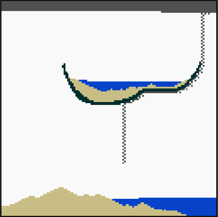

# Parxels

#### (Particle Pixels)

 

## An interactive WebAssembly app written in Go

## &nbsp;

### Presents an interactive grid where the user can place different kinds of particle pixels that interact with each other and follow simple rules.

 

### Example Scene:

#

 

### How to Build and Run:

- Build on Linux with `GOOS=JS GOARCH=wasm go build -o main.wasm`
- Copy [wasm_exec.js](https://github.com/golang/go/blob/master/misc/wasm/wasm_exec.js) into the folder
- Run a web server capable of properly sending WebAssembly files
  - Only `index.html`, `style.css`, `main.wasm`, and `wasm_exec.js` are required.
- Done!
